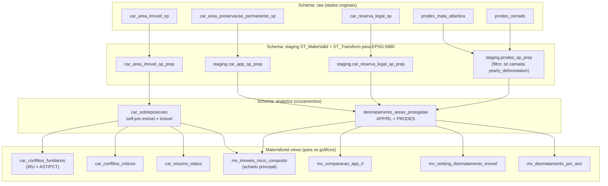

# BDGeo 2026

## Requisitos
- Docker
- Docker Compose

## 1) Subir o ambiente
```bash
docker compose up -d --build
```

## 2) Criar tabelas e funções do banco

```bash
docker compose --profile tools run --rm etl bash -lc 'psql -f ./sql/00-bdgeo.sql'
docker compose --profile tools run --rm etl bash -lc 'psql -f ./sql/01-bdgeo.sql'
```

## 3) Executar ETLs
```bash
docker compose --profile tools run --rm etl bash ./scripts/etl_cadastro_ambiental_rural.sh
docker compose --profile tools run --rm etl bash ./scripts/etl_prodes_desmatamentos.sh
```

# 4) Criar os buckets depois de subir o RustFS
```bash
docker compose --profile setup run --rm rustfs-setup
```


## Resumo

### Fluxo do pipeline



**Decisões técnicas do pipeline** (vale mencionar na seção de metodologia):
- Reprojeção de EPSG:4674 (geográfico) para EPSG:5880 (SIRGAS 2000 / Brazil Polyconic) — cálculos de área e interseção em coordenadas métricas, sem depender de zona UTM específica.
- `ST_MakeValid` aplicado a todas as camadas antes de qualquer cruzamento — CAR e PRODES têm parcela relevante de geometrias com self-intersections.
- Processamento em lotes com fallback linha-a-linha, pra lidar com geometrias corrompidas isoladas sem interromper o processamento de milhões de registros.

---

## Blocos de análise, cada um respondendo uma pergunta

### 1. Sobreposição entre imóveis do CAR
**Pergunta:** há cadastros que se sobrepõem entre si de forma incompatível com a realidade fundiária?

| Tabela | O que mostra |
|---|---|
| `car_resumo_status` | Gravidade cruzando status do cadastro (Ativo×Ativo é o que importa; Cancelado×Ativo costuma ser só histórico de correção) |
| `car_conflitos_criticos` | Pares com sobreposição >50% da área, classificados em moderado/severo/crítico |
| `car_conflitos_fundiarios` | **Achado mais forte deste bloco** — sobreposição entre `IRU` (imóvel privado) e `AST`/`PCT` (assentamento / comunidade tradicional). Tem significado jurídico direto, diferente de sobreposição genérica entre dois imóveis privados |

### 2. Desmatamento dentro de área legalmente protegida declarada
**Pergunta:** existe desmatamento (PRODES) dentro de área que o próprio proprietário declarou como protegida no CAR (APP ou Reserva Legal)?

| Tabela | O que mostra |
|---|---|
| `mv_desmatamento_por_ano` | Tendência temporal — aumentando ou diminuindo? |
| `mv_ranking_desmatamento_imovel` | Piores casos, por área desmatada acumulada |
| `mv_comparacao_app_rl` | Proporcionalmente, APP ou Reserva Legal sofre mais desmatamento? |

### 3. Risco composto (achado principal para fechar a apresentação)
**Pergunta:** existem imóveis que acumulam múltiplos indícios de irregularidade ao mesmo tempo?

| Tabela | O que mostra |
|---|---|
| `mv_imoveis_risco_composto` | Imóveis presentes tanto em conflito de sobreposição quanto em desmatamento de área protegida — lista priorizada de candidatos a auditoria |

---

